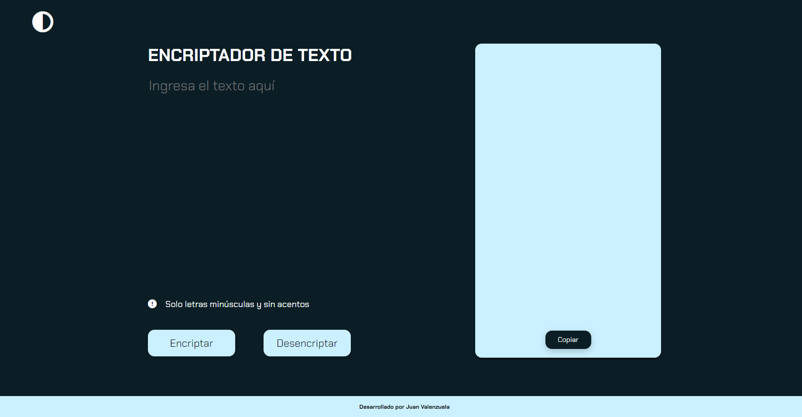

# ENCRIPTADOR DE TEXTO

Este proyecto es un encriptador de texto desarrollado como parte de un challenge de Alura Latam y Oracle. Permite encriptar y desencriptar mensajes de texto siguiendo reglas específicas.

## Características

- Encripta y desencripta texto.
- Copia el texto encriptado o desencriptado al portapapeles.
- Alterna entre tema claro y oscuro.

## Tecnologías Utilizadas

- **Frontend:** HTML5, CSS3, JavaScript ES6
- **Librerías:** Google Fonts, Font Awesome, Normalize.css

## Autor

- Juan Valenzuela
- https://github.com/Juan-Valenzuela3
- https://www.linkedin.com/in/juan-valenzuela-camelo

## Licencia

- Este proyecto está licenciado bajo la [Licencia MIT](./License.txt).

